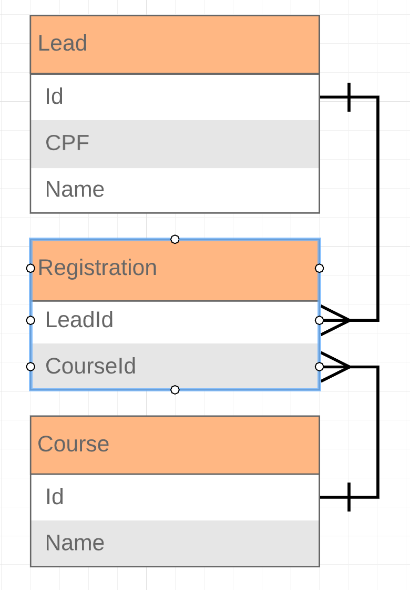

# Boas vindas ao projeto Ps-CRMEducacional!

Para executar o projeto, observe as orientações descritas a seguir.🚀

Aqui você vai encontrar os detalhes de como está estruturado e de como foi desenvolvido o projeto.

## :page_with_curl: Sobre
  Projeto desenvolvido por Gabriel Harmel para o teste técnico do processo seletivo da CRM Educacional.
  </br>
  Aplicação construída com C# em ASP .NET Core, tendo a comunicação com banco de dados realizada utilizando o ORM Entity Framework.
  </br>
  Esta API RESTful simula o cadastro de leads(candidatos), cursos e incrições no curso.
  <br />
  <br />

## :hammer_and_wrench: Ferramentas

* ASP .NET Core
* C#
* Entity Framework
* SQL Server
* Docker


# ## :whale2: Instalando e executando com Docker


<details>
  <summary><strong>Rodando no Docker</strong></summary><br />

  A aplicação foi pensada para ser testada com o Docker.
  
  Veja as orientações abaixo para iniciar a execução do projeto.
  > Rode o comando `export DOTNET_CONNECTION_STRING="Server=127.0.0.1;Database=tryitter_db;User=SA;Password=Password12!;TrustServerCertificate=true"`
  - Ele irá setar a variável de ambiente "DOTNET_CONNECTION_STRING" para que seja possível executar os comandos abaixo.
  > Rode o serviço com o comando `docker-compose up -d`.
  - Esse serviço irá inicializar um container chamado `ps-crmeducacional`.
  - A partir daqui você pode rodar o container `ps-crmeducacional` via CLI ou abri-lo no VS Code.
  > Use o comando `docker exec -it ps-crmeducacional bash`.
  - Ele te dará acesso ao terminal interativo do container criado pelo compose, que está rodando em segundo plano.
  > Instale as dependências com `dotnet restore`.
---
  
  ✨ **Dica:** Para rodar o projeto desta forma, obrigatoriamente você deve ter o ambiente `.NET` na versão 6.0.0 ou superior instalado em seu computador.

  ✨ **Dica:** Verifique se as portas 1433 (para execução do banco de dados), 5288 e 7027 (para execução da API) estão disponíveis no seu computador.

---

  ## Após a instalação das dependências

  > Use o comando `dotnet ef database update` para iniciar nosso banco de dados.
  - Ele inicializa e popula o banco de dados desenvolvido com a ORM Entity Framework. 
  Consulte o arquivo `docker-compose` para consultar as entradas para conexão de sua interface de banco de dados SQLServer. Recomendamos o `Azure Data Studio`.
  > Inicie a aplicação com os comandos `dotnet run`.
  - Para executar a aplicação em sua plataforma de cliente da API ou explorá-la no Swagger na seguinte rota:
    `https://localhost:7027/swagger/index.html`
---

  <br/>
</details>

<br/>

# ## :page_with_curl: Documentação

<details>
<summary><strong>Acessando documentação da API</strong></summary><br />

> Para consultar a documentação completa junto dos exemplos de requisição, após executar os comandos informados acima, acesse a rota:
- https://localhost:7027/swagger/index.html

Uma janela semelhante a essa deverá ser exibida
    


</details>

<details>
  <summary  id="diagrama"><strong>Diagrama ER e Entidades</strong></summary>

  ## Diagrama de Entidade-Relacionamento


  A construção das tabelas através do ORM, seguiu o seguinte *DER*:

  

  ---

  ## Formato das entidades


  Para a criação e atualização do banco de dados foi utilizado a `Entity Framework`. 

  A partir do DER, segue os exemplos com a descrição das tabelas do banco de dados:


  - Uma tabela chamada **Lead**, contendo dados com a seguinte estrutura:

    ```json
    {
      "id": 1,
      "name": "Bill G.",
      "cpf": "123.456.789-12",
    }
    ```
  - Uma tabela chamada **Course**, contendo dados com a seguinte estrutura:

    ```json
    {
      "id": 1, 
      "name": "Course Name",
    }
    ```

  - Uma tabela chamada **Registrations**, contendo dados com a seguinte estrutura:

    ```json
    {
      "leadId": 1,
      "postId": 1,
    }  
    ``` 

    *Os dados acima e do banco de dados são fictícios, e estão aqui apenas para simular o funcionamento da API.*

    ---

<br />

</details>

<br />

# Implementações

<details>
  <summary><strong> Rotas de lead </strong></summary>

### - Através do endpoint POST `/lead`

- O endpoint é acessível através do URL `/lead`;
- O endpoint deve ser capaz de criar um lead, retornando o status http `201`;
- O corpo da requisição segue o formato abaixo:
  ```json
  {
    "name": "Gabriel Harmel",
    "cpf": "123.456.789-12"
  }
  ```

<details>
  <summary><strong> Validações </strong></summary>

  * **[Será validado que não é possível criar um lead caso o CPF informado não estiver no formato correto]**
  - Caso o CPF informado não esteja no formato correto,  o resultado retornado deverá ser conforme exibido abaixo, com um status http `400`:
    ```json
    {
      "message": "O campo \"CPF\" deve estar no formato 123.456.789-10"
    }
    ```

  * **[Será validado que não é possível criar um lead com o nome vazio]**
  - Caso o campo `name` não tenha ao menos um caractere, o resultado retornado deverá ser conforme exibido abaixo, com um status http `400`:
    ```json
    {
      "message": "O campo \"Nome\" deve ter no mínimo 1 caractere"
    }
    ```
* **[Será validado que não é possível criar um lead com o nome acima de 58 caracteres]**
  - Caso o campo `name` tenha mais de 58 caracteres, o resultado retornado deverá ser conforme exibido abaixo, com um status http `400`:
    ```json
    {
      "message": "O campo \"Nome\" deve ter no máximo 58 caracteres"
    }
    ```
---


</details>

</details>

<details>
<summary><strong> Rotas de course </strong></summary>

### - Através do endpoint POST `/course`

- O endpoint é acessível através do URL `/course`;
- O endpoint deve ser capaz de criar um course, retornando o status http `201`;
- O corpo da requisição segue o formato abaixo:
  ```json
  {
    "name": "course",
  }
  ```

<details>
  <summary><strong> Validações </strong></summary>

  * **[Será validado que não é possível criar um course com o nome vazio]**
  - Caso o campo `name` não tenha ao menos um caractere, o resultado retornado deverá ser conforme exibido abaixo, com um status http `400`:
    ```json
    {
      "message": "O campo \"Nome\" deve ter no mínimo 1 caractere"
    }
    ```

* **[Será validado que não é possível criar um course com o nome acima de 58 caracteres]**
  - Caso o campo `name` tenha mais de 58 caracteres, o resultado retornado deverá ser conforme exibido abaixo, com um status http `400`:
    ```json
    {
      "message": "O campo \"Nome\" deve ter no máximo 58 caracteres"
    }
    ```
</details>
    
</details>

<details>
<summary><strong> Rotas de registration </strong></summary>

### - Através do endpoint POST `/registration`

- O endpoint é acessível através do URL `/registration`;
- O endpoint deve ser capaz de criar um course, retornando o status http `201`;
- O corpo da requisição segue o formato abaixo:
  ```json
  {
    "idLead": 1,
    "idCourse": 1
  }      
  ```

<details>
  <summary><strong> Validações </strong></summary>

  * **[Será validado que não é possível criar um registation com idLead ou idCourse inválidos e/ou inexistentes]**
  - Caso o campo `idLead` ou `idCourse` não existam em suas respectivas tabelas ou a registration já esteja cadastrada, o resultado retornado deverá ser conforme exibido abaixo, com um status http `400`:
    ```json
    {
      "message": "CourseId e/ou LeadId inválido ou inexistente"
    }
    ```


</details>